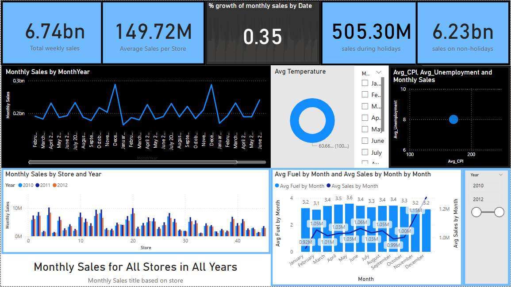

# 📊 Walmart Sales Analysis Dashboard (Power BI)

This project is a complete **Sales Analysis Dashboard** for Walmart built using **Power BI**, focused on uncovering trends and correlations in Walmart sales data across time, stores, holidays, and economic factors 
like (fuel_price , temperature , unemployment , CPI(consumer price index))

## 🔍 Overview

The dashboard provides interactive and visual insights on:
- 📅 Monthly and weekly sales trends  
- 🏬 Store-level sales performance (2010–2012)  
- 🎉 Impact of holidays on sales  
- 📈 Influence of economic indicators (CPI & Unemployment)  
- 🌡️ Weather conditions and their relation to sales  
- ⛽ Fuel prices vs monthly average sales  

## 📷 Dashboard Preview

> You can also find the full-resolution image in the repository for better viewing.

## ⚙️ Technologies Used

- 🧠 **Power BI**
- 📅 **Time-series Analysis**
- 📉 **DAX Measures**
- 📊 Data Modeling (Star Schema: `fact_sales`, `Dim_store`, `Dim_Date`, `Dim_Weather`, `Dim_Economic_Data`)

## 💡 Key Insights

- **Holiday Sales**: Holidays contribute significantly less (505.30M) compared to non-holidays (6.23bn).
- **Store Performance**: Some stores consistently outperform others — especially in 2011.
- **Fuel Prices**: Months with higher average fuel costs still see steady sales.
- **Economic Factors**: CPI and unemployment levels show moderate correlation with sales volumes.

## 🚀 Getting Started

1. Clone this repository.
2. Open `walmart sales project.pbix` in Power BI Desktop.
3. Explore and interact with the dashboard filters and visuals.

## 🤝 Contributing

Have ideas or want to add more datasets or KPIs? Feel free to fork and submit a pull request.

## 📬 Contact

**Nikhil Ganesh Vegi**  
📧 nikhilganeshvegi@gmail.com  

---

⭐ If you found this project useful, feel free to give it a star!

